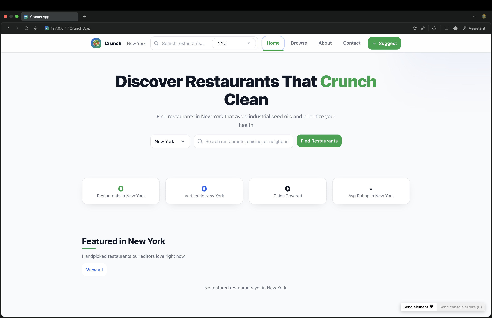
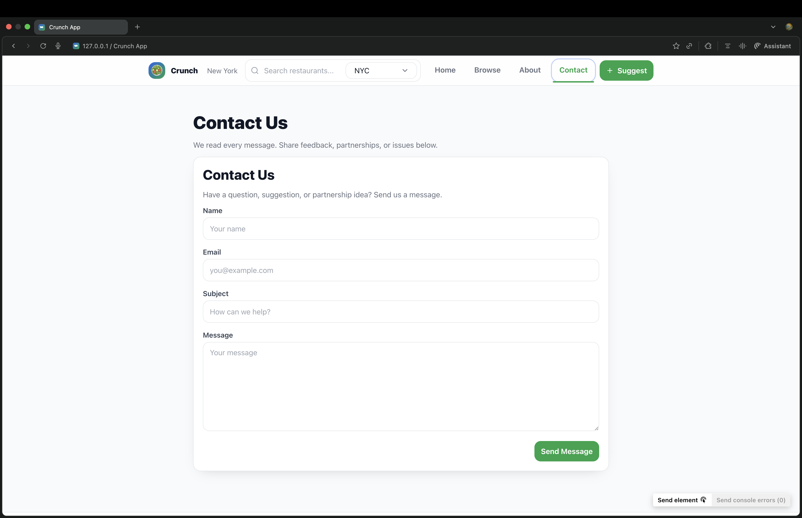
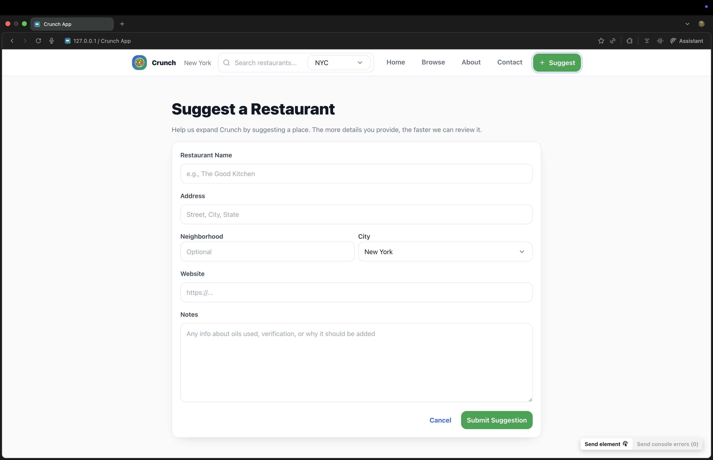

# Crunch

Discover restaurants that align with your dietary preferences — avoid seed oils, find gluten-free spots, and choose places that match your lifestyle.

Crunch is a modern Vite + React app that connects people with ingredient-conscious restaurants, featuring a clean, responsive UI and a growing, community-driven directory.

## Overview

Crunch helps you:
- Search and filter restaurants by city, neighborhood, cuisine, price, and dietary tags.
- See which restaurants are verified by the Crunch team.
- Suggest new restaurants and contact the team.
- Browse a beautiful, mobile-friendly interface with quick loading states and accessible controls.

The app is powered by Supabase for data and auth, and Mapbox (optional) for maps.

## Features

- **Unified homepage experience**
  Modern hero, featured restaurants, and live stats (restaurants, verified, cities, average rating) pulled from the database.

- **Powerful search and filters**
  Filter by diet (e.g., no seed oils, gluten-free), oils used/avoided, neighborhood, price range, and verified status.

- **Verified listings**
  Clear visual indicators and metadata for verified restaurants, including last updated dates.

- **Suggest a restaurant**
  Community-driven submissions with a clean form and validation.

- **Contact the team**
  Simple contact form that persists messages via Supabase.

- **Accessible & responsive UI**
  Keyboard-friendly focus-visible outlines, semantic markup, and mobile-first layout.

- **Delightful UX**
  Loading skeletons, toast notifications, and consistent green-brand details across the app.

- **Hash-based navigation**
  Client-side routing via URL hash for simple deploys (no extra router dependency required).

- **Admin (scaffolded)**
  Placeholder view for future admin workflows.

## How It Works

- **Data layer (Supabase)**
  - Tables (typical setup):
    - `restaurants`: primary directory records (name, address, city, oils used/avoided, tags, verified, rating, etc.)
    - `pending`: user-submitted suggestions pending review
    - `newsletter_subscriptions`: email subscriptions
    - `contact_messages`: messages from the contact form
    - `users`: optional roles (e.g., admin)
  - Client is initialized in `src/lib/supabaseClient.ts` using `VITE_SUPABASE_URL` and `VITE_SUPABASE_ANON_KEY`.
  - Service-role keys are never used in the client. Use serverless functions if you need privileged operations.

- **UI & State**
  - Root app logic and views live in `crunch_prototype.tsx`.
  - Styles are centralized in `src/styles/home.css` (no Tailwind required).
  - Components include a unified header, footer, and a shared `RestaurantCard`.
  - Views: home, results, about, contact, suggest, admin.

- **Navigation**
  - A small hash-based router syncs the URL (e.g., `#/home`, `#/results`) with view state.

- **Maps (optional)**
  - If `VITE_MAPBOX_TOKEN` is present, Mapbox GL can be enabled for map features.

## Tech Stack

- **Frontend**: React (Vite), TypeScript
- **Styling**: Custom CSS (single design system in `src/styles/home.css`)
- **Data & Auth**: Supabase (`@supabase/supabase-js`)
- **Icons**: `lucide-react`
- **Maps (optional)**: Mapbox GL

## Running Locally

Prerequisites:
- Node.js 18+
- A Supabase project (URL + anon key)
- (Optional) Mapbox token

1) Clone and install

```bash
npm install
```

2) Configure environment

Create a `.env.local` file in the project root:

```bash
# Supabase (public client-side keys)
VITE_SUPABASE_URL=your_supabase_url
VITE_SUPABASE_ANON_KEY=your_supabase_anon_key

# Mapbox (optional)
VITE_MAPBOX_TOKEN=your_mapbox_token
```

Notes:
- Never use the Supabase service role key in the client or in `VITE_` variables.
- `.env.local` is already gitignored.

3) Start the dev server

```bash
npm run dev
```

Open the app (Vite usually prints the URL, default: `http://localhost:5173`).

## Project Structure

```
crunch-app/
├─ index.html
├─ package.json
├─ src/
│  ├─ main.tsx                 # App entry
│  ├─ styles/home.css          # Global styles / design system
│  ├─ lib/supabaseClient.ts    # Supabase client init
│  └─ components/              # (Optional) UI components
├─ crunch_prototype.tsx        # Primary app component & views
├─ public/
│  ├─ favicon.svg
│  ├─ favicon.png (optional)
│  ├─ apple-touch-icon.png (optional)
│  └─ site.webmanifest
└─ .gitignore
```

## Deployment

- Since this is a client app, you can deploy to any static hosting (Netlify, Vercel, GitHub Pages) or your own hosting.
- Ensure environment variables are configured in your hosting platform (as `VITE_*` build-time variables).

## Screenshots

Place your screenshots under `public/screenshots/` and ensure the filenames match the references below.

- **Home**  
  

- **Contact**  
  

- **Suggest a Restaurant**  
  

- **About**  
  

Tips:
- Use your browser’s responsive mode to capture both desktop and mobile.
- Before capturing, populate the database with a few entries so Featured/Results and stats look rich.
- Name files as shown above or update the paths in this README accordingly.

## License

MIT License © 2025 Crunch
=======
